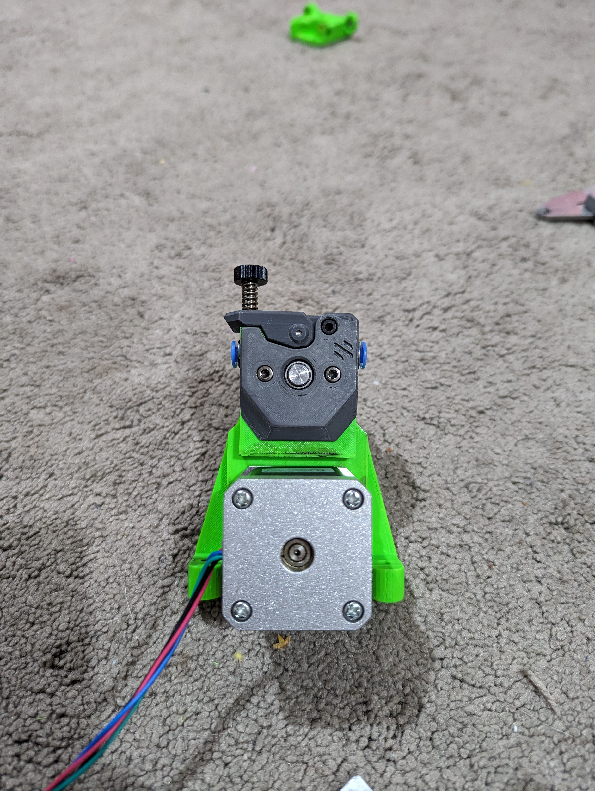
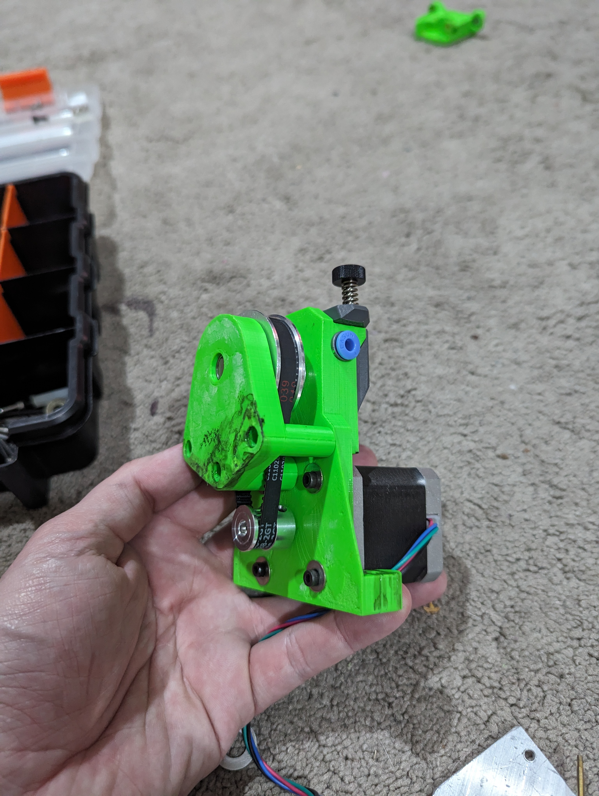
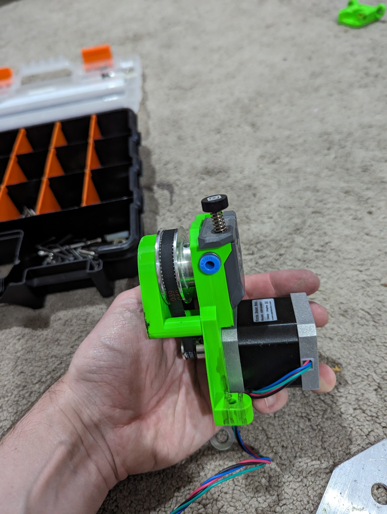
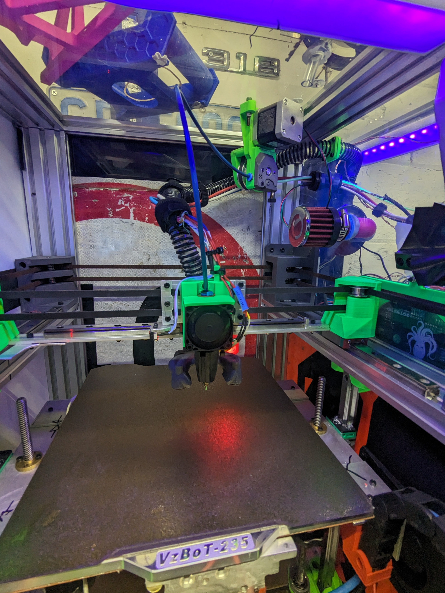

<H1>G2SA Bowden - NEMA17 + Belt Drive Mod</H1>
 
These two 3D printed parts repalce the "Main Body" of the G2SA Bowden (Not the 180 version).
 
BOM: 
8mm shaft  
Bearing 
20T Pulley 
60T Pulley 
188m GT2 Belt 
Various M3 bolts.  
M3 Heat insets. 
 

